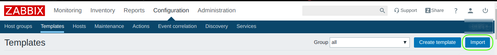
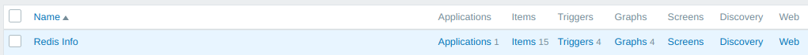
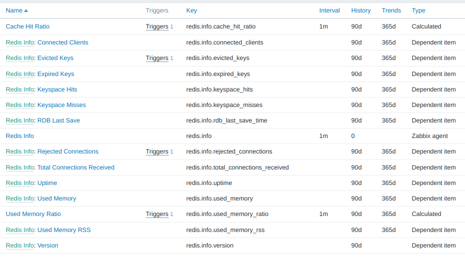
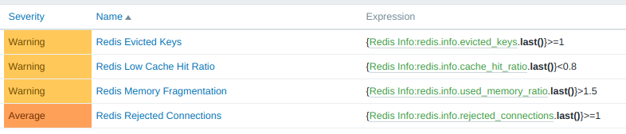
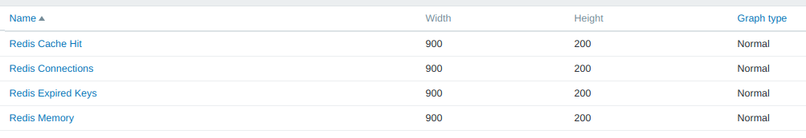

# zabbix_plugin_redis

Zabbix plugin to monitor Redis server.

The project is additional stuff for [this Habr publication](https://habr.com/ru/post/485538/) (in Russian).


## Setup Zabbix server

Import `./server/zabbix_template_redis.xml` file as Zabbix template using `Configuration / Templates` and button `Import` on the server side:




### Expected result

#### Template


#### Issues


#### Triggers


#### Graphs



## Setup Zabbix agent

### `userparameter_redis.conf`

Place file `./agent/userparameter_redis.conf` as `/etc/zabbix/zabbix_agentd.d/userparameter_redis.conf` then restart Zabbix agent:
```
$ sudo service zabbix-agent restart
```


### `get_info.sh`

Place file `./agent/get_info.sh` as `/var/lib/zabbix/user_parameter/redis/get_info.sh` and setup executable permissions for user `zabbix` on this file:
```
$ ls -lh /var/lib/zabbix/user_parameter/redis/
-rwxr-x--- 1 zabbix zabbix 2.4K Jan 21 09:14 get_info.sh
```